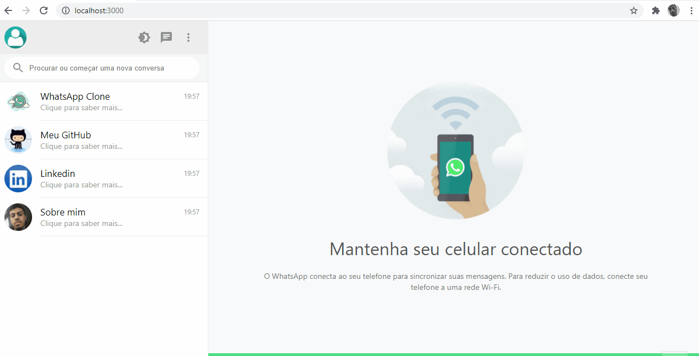
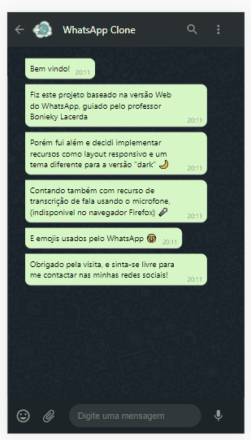

## WhatsApp Web Clone
---
Desenvolvido com base na aula do professor [Bonieky Lacerda](https://www.youtube.com/c/BoniekyLacerdaLeal)

## 🤓Fui além do desafio!
* Deixei o design responsivo, se adaptando a diversos tamanhos de tela
* Utilizei Styled-components na estilização
* Adicionei um Theme Switcher (dark)

## 📷Veja:

 
 

## 💻Tecnologias
✔️ React Js  
✔️ React Hooks  
✔️ Styled-components  
✔️ Emoji-picker  

 

## ⚙️Configuração
1- Para instalar as dependências:
> npm install

2- Para iniciar a aplicação:
> npm start
